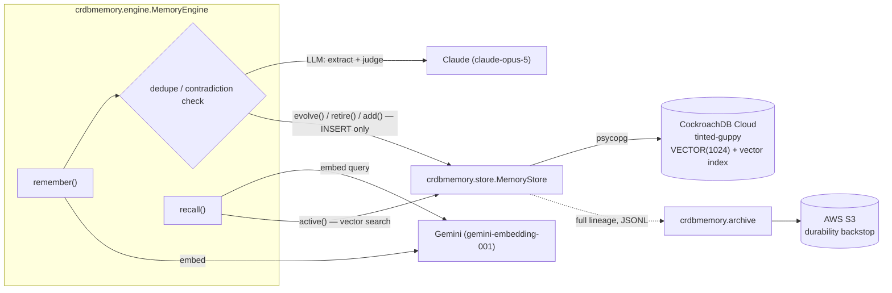

# crdb-memory — memory that survives

Governed, append-only agent memory backed by **CockroachDB Cloud**, with an **AWS S3**
durability backstop. Built for the [CockroachDB × AWS Agentic Memory Challenge](https://cockroachdb-ai.devpost.com).

Most agent memory stores are either a naive append log (recall quality degrades as
duplicates and stale facts pile up) or an UPDATE-based store that quietly loses history
the moment a node goes down mid-write. This one is neither: every write is an `INSERT`,
memory lifecycle (reinforce / contradict / supersede) is modeled as lineage, not mutation,
and a distributed cluster can lose a node mid-conversation without losing or corrupting a
single guest's memory.

## The idea

A hotel concierge agent remembers guest preferences across stays — "prefers window
seating," "allergic to shellfish" — and needs to (a) not re-ask what it already knows,
(b) recognize when a new statement contradicts an old one and retire the old one instead
of accumulating a contradiction, and (c) keep working through a node failure without
losing what it just learned. This project builds that governance loop directly on
CockroachDB's distributed storage instead of layering it on top of a single-node database.

## Architecture



- **`store.py`** — append-only: nothing is ever `UPDATE`d or `DELETE`d. Reinforcing a
  memory and superseding it are the same operation underneath (`evolve()`): INSERT a new
  row whose `supersedes` column points at the one it replaces. A memory is "active" if
  it's the tip of its lineage chain — the row nothing else points `supersedes` at. A
  killed node can only ever cost an uncommitted `INSERT`; it can never corrupt existing
  history, because nothing is ever mutated in place.
- **`engine.py`** — the governance loop: extract candidate memories from a transcript,
  dedupe against existing ones by embedding similarity, run an LLM contradiction check in
  the gray zone, and reinforce/supersede/store accordingly. Recall scores by
  `cosine similarity × recency decay × importance × reinforcement boost`.
- **`llm.py`** — Claude (`claude-opus-5`) for extraction and contradiction judging via
  structured outputs (`output_config.format`); Gemini (`gemini-embedding-001`) for
  embeddings, since Claude has no embeddings endpoint. A deterministic `MockClient`
  backend runs the entire pipeline offline with zero API keys.
- **`archive.py`** — the AWS half of "survives": exports the full memory lineage (every
  guest, every row, including retired tombstones) to S3 as JSONL. The whole ledger is
  replayable into a fresh cluster even if the CockroachDB cluster itself were lost, not
  just a node within it.

## Mandatory tech

- **CockroachDB Cloud Managed MCP Server** — used throughout development to inspect
  schema, run queries, and manage the cluster directly from an AI coding assistant
  (Claude Code), the intended use of the Console-issued MCP connection.
- **CockroachDB Distributed Vector Indexing** — `guest_memories.embedding VECTOR(1024)`
  with a `vector_cosine_ops` vector index; `store.nearest()` issues a real
  `ORDER BY embedding <=> query LIMIT k` against it, and both `recall()` and dedupe use
  it for candidate retrieval instead of scanning every active memory in Python. At the
  low row counts a live demo runs at, CRDB's cost-based optimizer may choose a full scan
  over the index (`EXPLAIN`-verified, documented CockroachDB behavior — `ANALYZE` after
  seeding real data volume is what flips it) — the query and results are correct either
  way; only the physical plan changes with data size.
- **AWS (S3)** — `archive.py`'s durability backstop, described above.

## Code reuse disclosure

The append-only storage engine (`store.py`), the CockroachDB schema, the Claude+Gemini
LLM integration, the S3 archive/restore path, and the node-kill demo were all written for
this submission.

The **governance algorithm** in `engine.py` — the dedupe/contradiction-check control flow
and the recall scoring formula — is adapted from a pre-existing personal project:
[`majordomo`](https://github.com/axiom-orion/majordomo), a SQLite + Qwen hotel-concierge
memory agent written before this submission period and published publicly on 2026-07-21
for a separate hackathon. The *algorithm* (thresholds, when to reinforce vs. supersede, the
scoring formula) carries over; every line of code implementing it here was rewritten from
scratch for CockroachDB's append-only constraints (the original used in-place `UPDATE`,
which this project deliberately does not) and for the Claude/Gemini backend.

Both repositories are public, so that claim is checkable rather than asserted — read
`majordomo`'s store alongside `store.py` here and the difference between an UPDATE-based
design and an append-only lineage chain is the whole point of this project.

## Running it

```bash
python -m venv .venv && .venv/Scripts/pip install -e .
cp .env.example .env   # fill in DATABASE_URL, GEMINI_API_KEY, etc.
```

`LLM_BACKEND=mock` (the default) runs the entire pipeline — extraction, dedupe,
contradiction judging, embeddings — offline and deterministically, with zero API keys.
Set `LLM_BACKEND=live` and provide `ANTHROPIC_API_KEY`/`ant auth login` +
`GEMINI_API_KEY` to use real Claude + Gemini.

```python
from crdbmemory.store import MemoryStore
from crdbmemory.engine import MemoryEngine

store = MemoryStore()
engine = MemoryEngine(store=store)
engine.remember("guest-1", "Guest: I prefer window seating.", session_id="s1")
engine.recall("guest-1", "seating preference")
```

### Node-kill resilience demo

```bash
scripts/local_cluster.sh up      # spins up a local 3-node CockroachDB cluster
python scripts/node_kill_demo.py # kills a node mid-conversation, proves the memory survives
scripts/local_cluster.sh down    # tear down
```

This runs against a local cluster, not CockroachDB Cloud — Cloud's serverless tier
doesn't expose manual node control. The production data path is real CockroachDB Cloud;
this demo proves the resilience guarantee on the same underlying distributed engine.

## License

Apache-2.0 — see [LICENSE](LICENSE).
